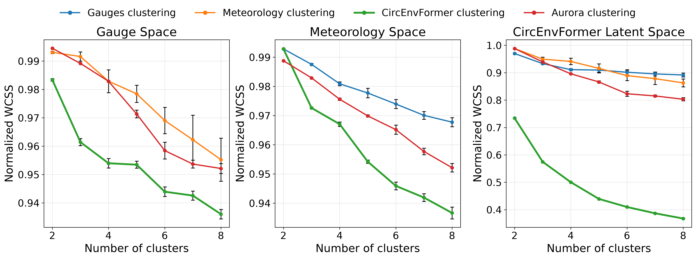
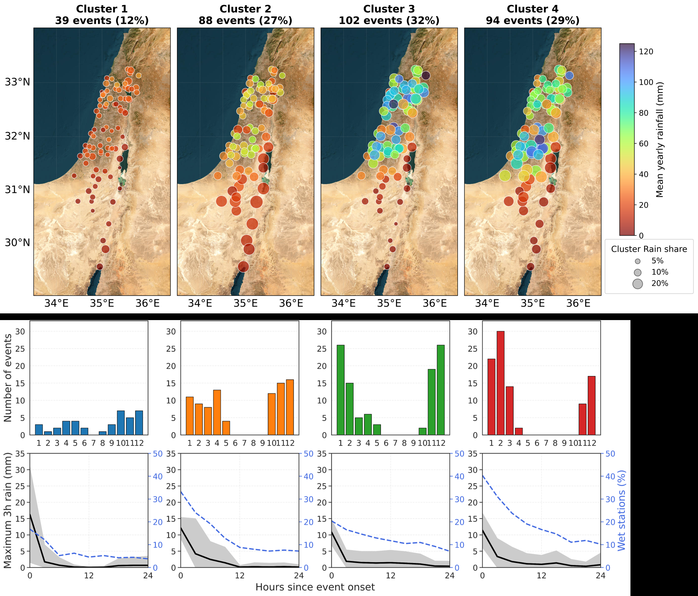
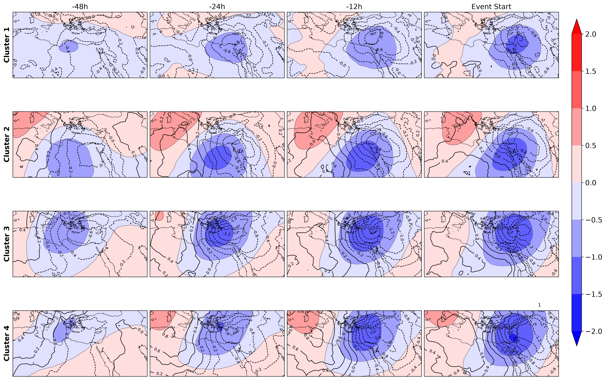
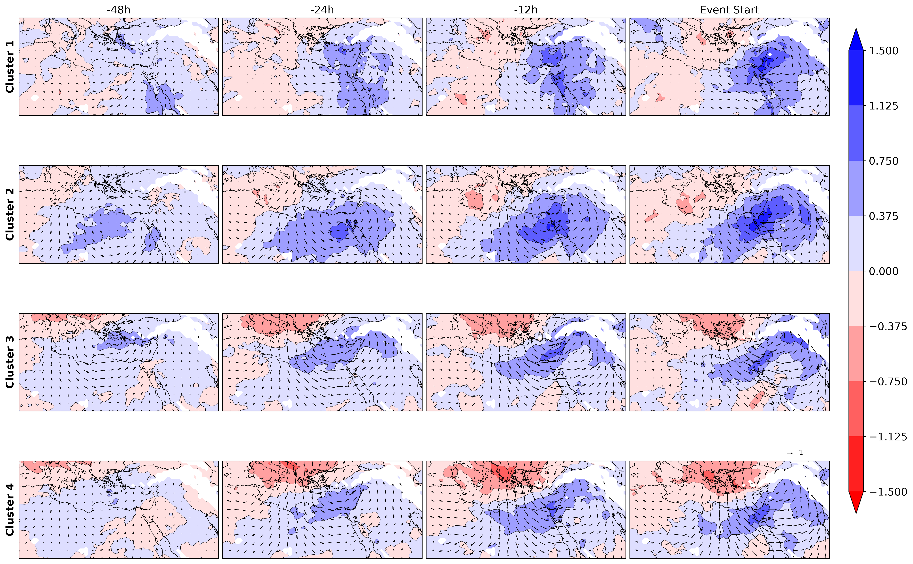

# CircEnvFormer

## Learning Interpretable Environmentally Supervised Atmospheric Classification

  

CircEnvFormer is an environmentally supervised atmospheric representation learning framework that learns atmospheric embeddings by predicting local environmental observations from large-scale circulation. The environmental response provides the supervisory signal, organizing the latent space so that atmospheric states producing similar environmental responses can be grouped into physically meaningful synoptic regimes.

## Study

We demonstrate CircEnvFormer using rainfall-producing weather systems over the Levant drylands for 2000–2025. Large-scale ERA5 atmospheric fields are used to predict local rainfall occurrence from a network of 27 dryland rain gauges operated by the Israel Meteorological Service. The learned event embeddings are subsequently clustered using *k*-means.

## Authors

**[Ron Sarafian](https://www.ronsarafian.com/)** — Department of Environmental and Geoinformatics, Ben-Gurion University of the Negev, Israel  
**Shira Raveh-Rubin** — Earth and Planetary Sciences, Weizmann Institute of Science, Israel  
**Salman Khan** — Mohamed bin Zayed University of Artificial Intelligence, Abu Dhabi  
**Dori Nissenbaum** — Earth and Planetary Sciences, Weizmann Institute of Science, Israel  
**Reuven H. Heiblum** — Earth and Planetary Sciences, Weizmann Institute of Science, Israel  
**Meira Barron** — Statistics and Data Science, Hebrew University of Jerusalem, Israel  
**Yinon Rudich** — Earth and Planetary Sciences, Weizmann Institute of Science, Israel

## Representation quality

CircEnvFormer produces more compact synoptic classifications than environmental observations, PCA-reduced atmospheric representations, and pretrained Aurora representations across the evaluated representation spaces.

  

The four-cluster solution provides an interpretable balance between meteorological interpretability and statistical robustness. Across 20 random-seed repetitions, the mean pairwise adjusted Rand index is 0.926 ± 0.071.

## Four learned synoptic regimes

Clustering the learned representation with *K* = 4 yields four rainfall-producing regimes with distinct environmental and atmospheric characteristics.

  

**Cluster 1** is associated with comparatively weak synoptic-scale circulation anomalies, short-lived and highly localized rainfall, and high event intensity.

**Cluster 2** is distinguished by persistent long-range moisture transport from North Africa into the eastern Mediterranean and an increasing contribution to annual rainfall toward the arid southern Levant.

**Clusters 3 and 4** are winter-dominated Mediterranean-cyclone regimes, with Cluster 3 producing more intense rainfall over northern regions and Cluster 4 producing the broadest spatial rainfall coverage.

  

  

The circulation composites show the distinct dynamical structures and temporal evolution associated with the four learned regimes, including differences in cyclone development and moisture-transport pathways.

## Data

ERA5 reanalysis data are publicly available through the Copernicus Climate Data Store. IMS in-situ precipitation data are publicly available at <https://ims.gov.il/en/data_gov>.

## Contact

For inquiries, please contact [ronsar@bgu.ac.il](mailto:ronsar@bgu.ac.il) or [yinon.rudich@weizmann.ac.il](mailto:yinon.rudich@weizmann.ac.il).
