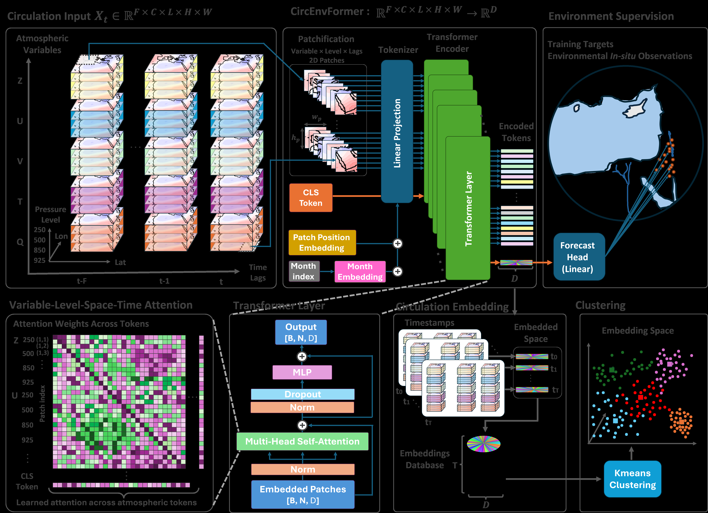

# CircEnvFormer

> Official PyTorch implementation of **CircEnvFormer: Learning Physically Supervised Atmospheric Representations for Interpretable Synoptic Classification**

<p align="center">
  
</p>

## Overview

CircEnvFormer is a physically supervised atmospheric representation learning framework for synoptic classification.

Instead of clustering atmospheric circulation directly, CircEnvFormer learns atmospheric embeddings by solving a circulation-to-environment forecasting task. The learned latent representations are subsequently clustered to identify physically meaningful synoptic regimes.

This repository accompanies the paper:

> **CircEnvFormer: Learning Physically Supervised Atmospheric Representations for Interpretable Synoptic Classification**

---

## Highlights

- Transformer-based atmospheric representation learning
- Physically supervised latent embeddings
- Interpretable synoptic classification
- Attention rollout for physical interpretation
- End-to-end pipeline from ERA5 to synoptic regimes

---

## Repository Structure

```text
configs/              experiment configurations

datasets/             data loading and preprocessing

models/               CircEnvFormer architecture

training/             training pipeline

evaluation/           forecasting and clustering evaluation

interpretability/     attention rollout and attribution

visualization/        plotting utilities

scripts/              executable scripts

notebooks/            tutorial notebooks

figures/              paper figures
```

---

## Data

The repository uses

- ERA5 reanalysis (publicly available)
- Israel Meteorological Service (IMS) rain-gauge observations

Because IMS observations cannot be redistributed, this repository does not include the raw rainfall data.

---

## Installation

```bash
conda env create -f environment.yml
conda activate circenvformer
```

---

## Citation

If you use this repository, please cite

```bibtex
@article{TODO,
  title={CircEnvFormer: Learning Physically Supervised Atmospheric Representations for Interpretable Synoptic Classification},
  author={Sarafian, Ron and others},
  year={2026}
}
```

---

## License

See LICENSE.